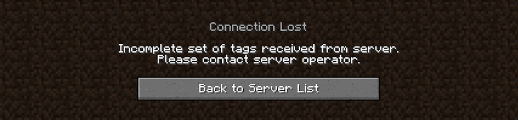

# Tags Fixer (Forge 1.16.5)

Вы сталкивались с проблемой "От сервера получен неполный набор тегов", когда хотели зайти на ванильный сервер с 
модифицированного клиента, но вы не хотите убирать лишние моды? Тогда, этот мод вполне может исправить данную проблему.

## Что он делает?
При подключении к серверу, клиент хочет получить все теги, которые требуются модами. Это теги блоков, жидкостей, 
мобов и предметов. Если он не находит даже один тег, то он не подключается к серверу.

Мод частично модифицирует код игры, при помощи Mixin'ов. Теперь, теги будет обрабатывать сам мод.

Если он не находит какой-либо тег, то в игре он присваивает к ID ненайденного тега тег-пустышку.

**Важно:** Мод не реализует теги, не наполняет их каким-либо содержимым, а всего лишь создаёт иллюзию того, что 
пропущенный тег присутствует.

## Зачем это нужно?
Это нужно Minecraft-проектам, использующим одновременно и модифицированные сервера Forge, и ванильные или плагинные 
сервера (например, Paper), которые переадресовывают людей с модифицированных серверов на ванильные и обратно при помощи
прокси (например, Velocity).

Так же, это может быть полезно при тех случаях, когда в каком либо моде есть полезная функция, но клиент не заходит на 
сервера без него по ошибке, которую исправляет этот мод.

## Сборка
Скачайте проект, из консоли зайдите в директорию проекта и пропишите `./gradlew build` (или `gradlew.bat build` 
если сборка происходит из-под Windows).
Собранный проект будет лежать в директории `build/libs/`